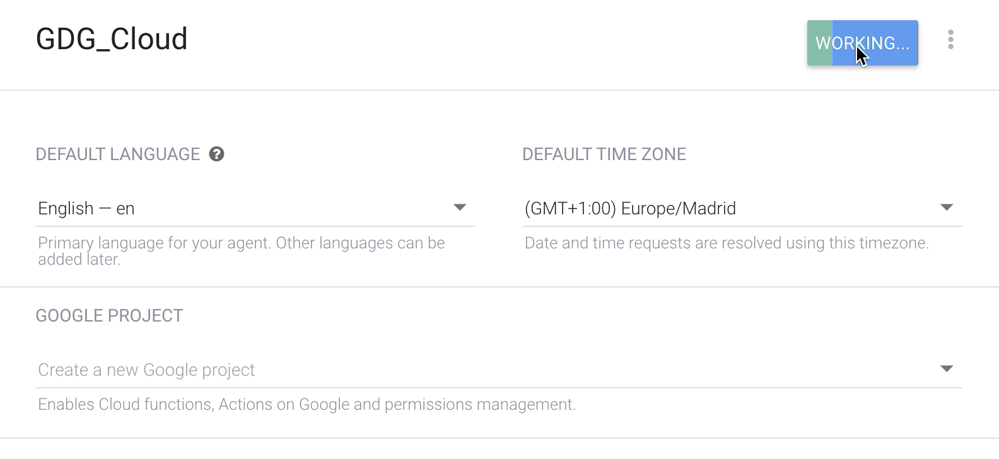

# Agent

It translates the user requests to actionable data.

The agents allow you to manage the conversation flow matching the words the users have typed in.

1. Access [www.dialogflow.com](http://www.dialogflow.com)
2. Sign up/ Sign in with your Google account
3. Click `Create Agent` on menu top left
4. Name it `GDG_Cloud`

