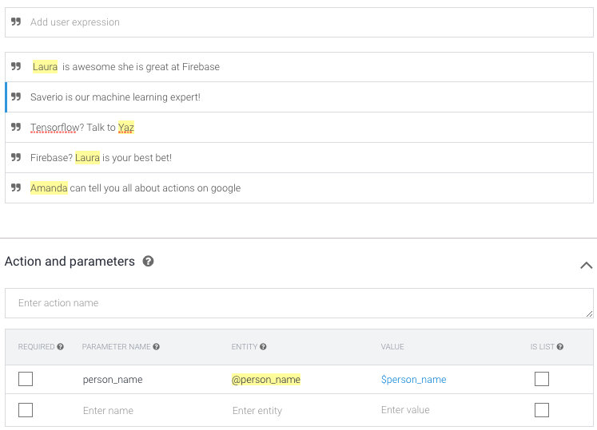
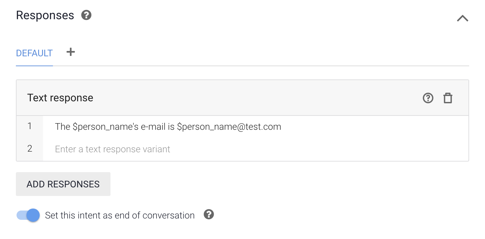

# Default Welcome Intent - search - get\_name

## Steps

1. Click `Intent` on the left menu.
2. Hover on `Default Welcome Intent - search`.
3. Click on `Add follow-up intent`.
4. Choose `Custom` from the select menu.
5. This will take you to the new created follow-up intent.
6. Rename it to `Default Welcome Intent - search - get_name`.
7. Click `save`.
8. Under `Training phrases` a add a few sentences\(image example below\). You'll see the names are already recognised from our previously created entity `@person_name`
9. Under Responses add some dummy/test responses \(image example below\).

## Explanation

We were given two selections, either search by `name` or `skill`.

This is the follow-up intent  deals with the names.

For now add some test responses in the `Responses`.

