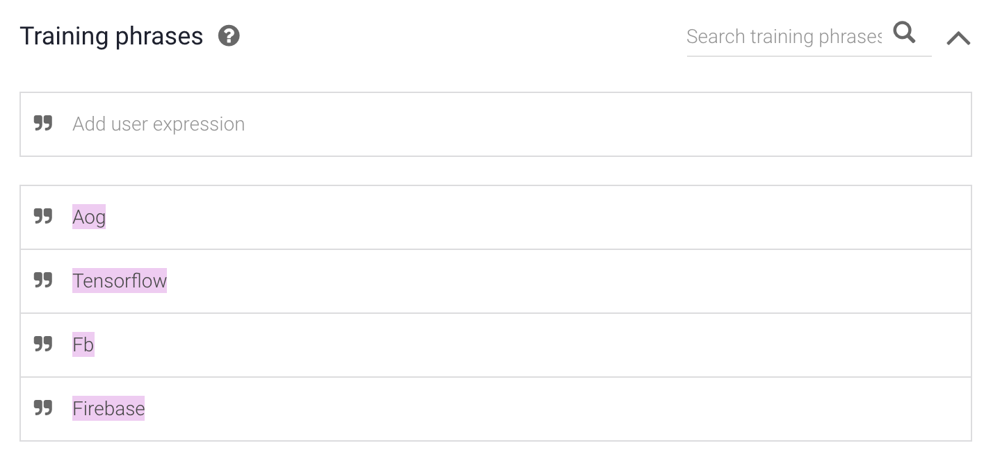
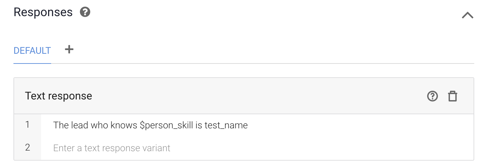

# Default Welcome Intent - search - get\_skill

## Steps

1. Click `Intent` on the left menu
2. Hover on `Default Welcome Intent - search`
3. Click on `Add follow-up intent`
4. Choose `Custom` from the select menu.
5. This will take you to the new created follow-up intent
6. Rename it to `Default Welcome Intent - search - get_skill`
7. Click `save`.
8. Under `Training phrases` add a few skills.
9. Under Responses add some dummy responses.

## Explanation

We were given two selections, either search by `name` or `skill`.

This is the follow-up intent deals with the `skills`.

For now add some test responses in the `Responses`.

