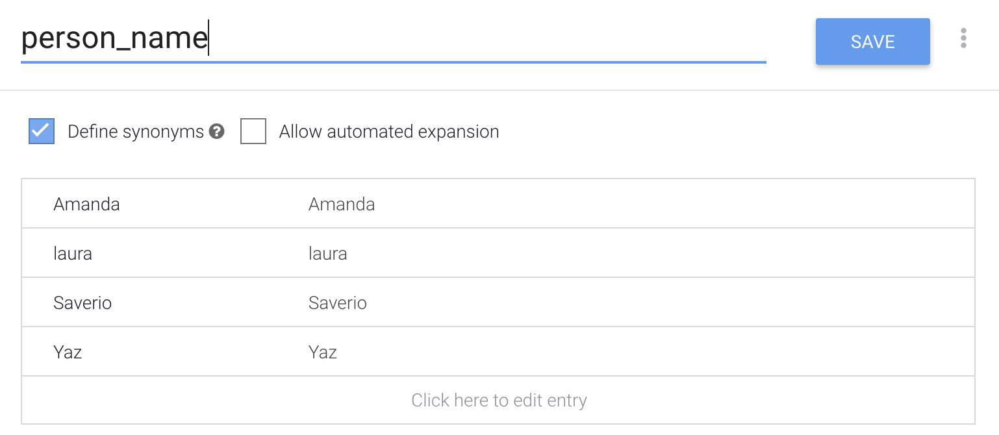
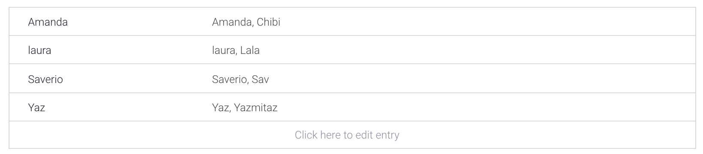

# person\_name entity

## **What is the GDG Cloud lead's** `name`**?**

The GDG Cloud lead is `Amanda`.

### **Steps**

1. On the left menu click `Entity`.
2. Click the blue button that says `Create entity`.
3. Name it `person_name`.
4. Type in the names
5. Click save.
6. 🌟You've created your first `entity`

\*\*\*\*

