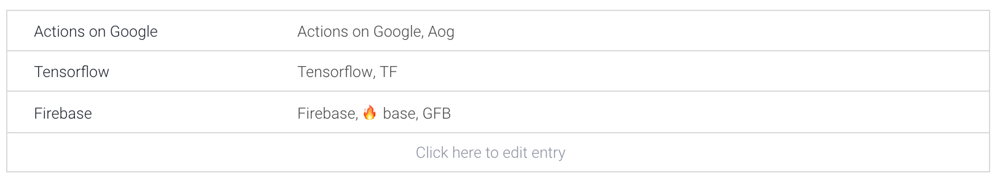

# person\_skill entity

## Steps

1. On the left menu click `Entity`.
2. Click the blue button that says `Create entity`.
3. Name it `person_skill`.
4. Type in the technology skill you know and their synonyms.
5. Click `save`.
6. 🌟You've created your second entity

## **Explanation**

Imagine we have the question:

What is the GDG Cloud organiser `skill`?

We would like to fill the slot `skill` with an answer.

The GDG Cloud lead Yaz is based in London. He is excellent at `Tensorflow`.

Amanda is is brilliant at `Actions on Google`.

Saverio can tell you all about `Machine Learning`.

Laura is our `Firebase` expert!

