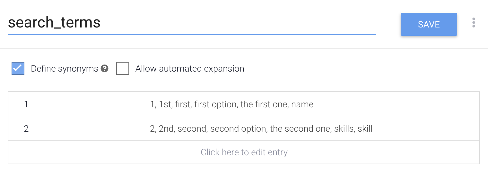

# search\_terms entity

## Steps

1. On the left Menu click `Entity`.
2. Click the blue button that says `Create entity`.
3. Name it `search_terms`.
4. Type in the terms as in the image below.
5. Click save.
6. 🌟You've created your `search_terms` entity.

The final result should look like this:



If you prefer instead of typing each one, here's the CSV you can copy and paste:

1. Click the more \( 3 dots\) button
2. Click `Switch to raw mode`
3. Paste the data below within the CSV tab



```text
"1","1","1st","first","first option","the first one","name"
"2","2","2nd","second","second option","the second one","skills","skill"
```



4. Click `Save`

## **Explanation:**

The user is welcome to the conversation with the following message: 

 Agent says: `Hi! Welcome to the GDG Cloud directory conversational app. Would you like to find a lead by 1. Name, 2. Skill?`

The user then can reply stating they'd like one of the options. 

User says: `I would like to to search by skill.`

In order to being able to redirect our users to the correct flow and ask the right question. We create another entity that will handle what the user types in.

Our `search_terms` entity will have 2 values : 

`name` \(or 1\)

`skill` \(or 2\) 

