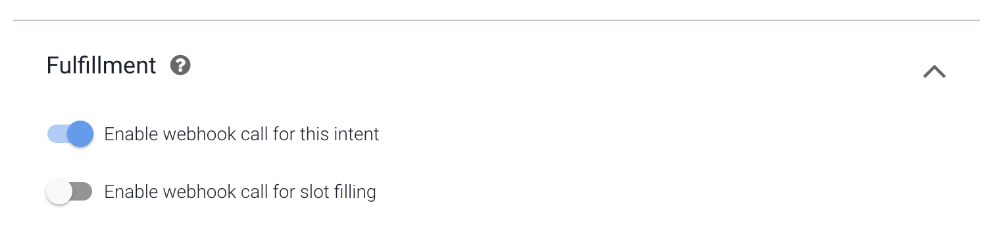

# Webhook

1. Go back to your `Default Welcome Intent` intent and make sure to enable the webhook call for this event.

2. Go back to your `Default Welcome Intent - search` intent and make sure to enable the webhook call for this event.

