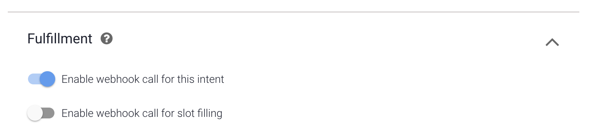

# Webhook & Action

1. Go back to your `Default Welcome Intent - get_name`intent and make sure to enable the webhook call for this event make the Action field empty.

2. Go back to your `Default Welcome Intent - get_skill` intent and make sure to enable the webhook call for this event and make the Action field empty.

